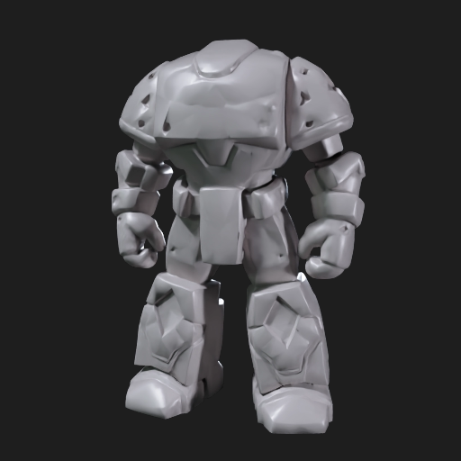

# Unity Meshy Studio

A Claude Code plugin for building Unity games, with a guarded pipeline for
generating 3D assets through [Meshy](https://www.meshy.ai) and getting them
into your project as proper prefabs.

I built this because asking Claude for Unity help kept producing the same
problems: code that compiles but ignores the render pipeline you're actually
on, generated models dumped into `Assets/` with no import settings, and
nothing stopping an agent from quietly burning API credits. The plugin packs
the Unity knowledge into 13 focused skills, and wraps every Meshy call that
costs money behind an explicit confirmation step.

## Install

```
claude plugin marketplace add aluminumBath/unity-meshy-studio
claude plugin install unity-meshy-studio@unity-meshy-studio
```

Then start a new Claude Code session inside your Unity project. The main
orchestrator is `/unity-meshy-studio:unity-meshy-studio`, but the specialist
skills also fire on their own when the task matches (performance work,
lighting, animation, and so on).

To use the Meshy features you need an API key from
[Meshy's API settings](https://app.meshy.ai/settings/api). Either export it
as `MESHY_API_KEY` before starting Claude Code, or run the guided login:

```
python -m pip install -r tools/requirements.txt
python tools/meshy_auth.py login
```

The login helper never asks for your Meshy password. It opens the browser for
you, prompts for the key without echoing it, verifies it against the balance
endpoint, and stores it in your OS credential store. An exported
`MESHY_API_KEY` always wins over the stored one.

## What generating an asset actually looks like

Here's a real run. Preview generation cost 20 credits and took about 80
seconds:

```
$ python tools/meshy_client.py balance
{ "balance": 3742 }

$ python tools/meshy_client.py text-to-3d-preview \
    --prompt "A single stylized stone golem, neutral pose, game-ready" \
    --confirm-spend
Current balance: {"balance": 3742}
{ "result": "019f568e-cab2-73ef-99cf-67ce47173639" }

$ python tools/meshy_client.py download --kind text-to-3d \
    --id 019f568e-cab2-73ef-99cf-67ce47173639 \
    --output Assets/Art/Generated/Meshy/StoneGolem
StoneGolem.glb
StoneGolem.fbx
StoneGolem.usdz
StoneGolem.obj
StoneGolem.stl
StoneGolem_thumbnail.png
task.json
```



Previews are untextured drafts. Once you like the shape, refine it (that's a
second paid step), then rig and animate if it's a character:

```
$ python tools/meshy_client.py text-to-3d-refine \
    --preview-task-id 019f568e-... --confirm-spend

$ python tools/meshy_client.py rig --input-task-id TASK_ID \
    --height-meters 1.8 --confirm-spend
$ python tools/meshy_client.py animate --rig-task-id RIG_TASK_ID \
    --action-id 0 --confirm-spend
```

Rigging returns the character plus free walking and running animations;
`animate` applies any action from [Meshy's animation
library](https://docs.meshy.ai/en/api/animation-library) by ID. One thing to
know: rigging runs pose estimation on the mesh, and it will reject models
without clear limb separation ("Pose estimation failed"). Generating
characters in a T-pose or A-pose avoids this — the bulky golem above fails,
a T-posed adventurer rigs fine.

There's also `image-to-3d` (pass `--image` a URL, data URI, or local
.jpg/.png; repeat it for multi-image up to 4), `remesh` for topology and
polycount changes, and `retexture` for restyling a model's surface.

### The credit rule

Every command that can spend credits refuses to run without
`--confirm-spend`, and prints your balance before submitting. When Claude is
driving, the skills require it to describe the exact operation and get your
approval first, every time. There is no batch mode and no way to pre-approve
a category of spending. That's deliberate.

## Unity import

The `Assets/Editor/MeshyPipeline` scripts give you sane defaults and health
checks inside the editor. Copy them into your project (or let the import
skill do it):

- Models under `Assets/Art/Generated/Meshy/` get import defaults applied
  automatically: materials imported, mesh optimization on, Generic rig with
  no avatar. Humanoid stays opt-in because auto-mapped avatars on generated
  meshes are wrong more often than they're right.
- `Tools > Meshy > Validate Generated Asset` inspects a model's importer
  settings in one place.
- `Tools > Unity Meshy Studio > Scan Generated Prefabs` flags generated
  prefabs missing renderers or colliders.

The editor scripts are verified against Unity 6000.0. The import skill keeps
gameplay code off the imported model itself and puts it on a wrapper prefab,
so a re-download never nukes your components.

## What's in the box

- **13 skills** — an orchestrator plus specialists for architecture, gameplay
  systems, UI, scenes/lighting, performance, animation, shaders, audio,
  testing/CI, release readiness, Meshy asset direction, and Unity import.
- **4 review agents** — technical director, art director, performance
  auditor, and a Meshy pipeline reviewer, for independent second passes.
- **A post-edit hook** that reminds Claude to re-validate Unity assets after
  it edits them.
- **Meshy's MCP server** declared in `.mcp.json` (reads `MESHY_API_KEY` from
  your environment; the key is never written into config).
- **`tools/meshy_client.py`** — a REST client used as a fallback when the MCP
  server isn't available. Covers balance, text-to-3D preview/refine,
  image-to-3D and multi-image (URLs, data URIs, or local files), remesh,
  retexture, rigging, animation (with FPS post-processing), task polling, and
  downloads. Every operation is tested against the live API.

## Troubleshooting

**`ModuleNotFoundError: No module named 'requests'`** — run
`python -m pip install -r tools/requirements.txt` first.

**Downloaded URLs from `task.json` return 403 (`MissingKey`)** — expected.
Meshy signs its asset URLs, and this tool strips the signature (along with
everything else in the query string) from any URL it saves or prints, so a
leaked log can't hand out your files. Re-run the `download` command instead
of fetching saved URLs by hand.

**Editor scripts don't compile on older Unity** — the scripts target the
Unity 6 `ModelImporter` API (`materialImportMode`,
`meshOptimizationFlags`). On 2022 LTS or earlier you'd need to swap those
back to the legacy properties.

**Plugin installed but skills don't show up** — plugins load at session
start. Restart Claude Code and check `/plugin`.

## Notes

MIT licensed. Independent project — not affiliated with or endorsed by Unity
Technologies, Anthropic, or Meshy. See `LICENSE`, `NOTICE.md`, `SECURITY.md`,
and `DEPENDENCIES.md`. Contributions welcome; `CONTRIBUTING.md` is short.
